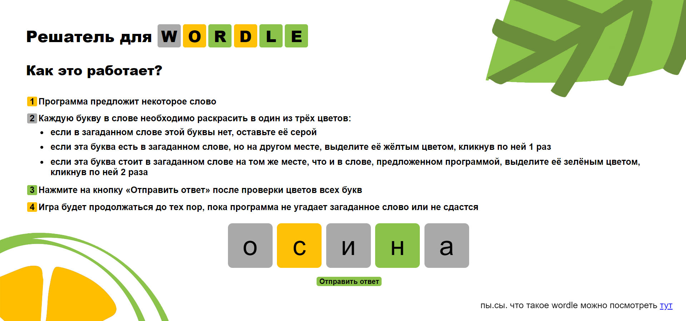

# WordleProject

Решатель Wordle — веб-приложение, которое угадывает пятибуквенное слово, загаданное пользователем.



## Как запустить?

### Windows, Командная строка:

```shell
git clone https://github.com/Spsaspsaspsa/WordleProject.git
cd WordleProject
pip install -r requirements.txt
start "" python -m uvicorn api:app --reload 
start "" python -m http.server -d web 80 
```

### Windows, Windows Powershell:

```shell
git clone https://github.com/Spsaspsaspsa/WordleProject.git
cd WordleProject
pip install -r requirements.txt
start python -ArgumentList "-m uvicorn api:app --reload"
start python -ArgumentList " -m http.server -d web 80"
```

Откройте по адресу [http://127.0.0.1](http://127.0.0.1)

## Структура репозитория

- sorted_words.py — отбор пятибуквенных существительных из словаря частотных лемм русского языка, их сортировка по частотности букв и количеству уникальных букв
- wordle_list.tsv — отсортированный список слов
- wordle.py — алгоритм, который по предложенному программой слову и ответу пользователя для каждого слова из списка определяет, нужно ли его удалить из списка или оставить в нём
- api.py — передача ответа пользователя программе и реализация алгоритма программы из файла wordle.py
- web
  - index.html — внешний вид веб-страницы
  - style.css — стили веб-страницы
  - background.jpg — фон веб-страницы
  - code
    - api.js — запуск и перезапуск игры, взаимодействие пользователя с backend-ом
    - button.js — класс кнопок, на которые нажимает пользователь
    - main.js — генерация токена пользователя и первоначальный вид веб-страницы
- .gitignore
- requirements.txt


## Использованные ресурсы:
- [частотность букв русского языка](http://dict.ruslang.ru/freq.php?act=show&dic=freq_letters&title=%D7%E0%F1%F2%EE%F2%ED%EE%F1%F2%FC%20%E1%F3%EA%E2%20%F0%F3%F1%F1%EA%EE%E3%EE%20%E0%EB%F4%E0%E2%E8%F2%E0)
- [частотный словарь лемм русского языка](http://dict.ruslang.ru/freq.php?act=show&dic=freq_freq&title=%D7%E0%F1%F2%EE%F2%ED%FB%E9%20%F1%EF%E8%F1%EE%EA%20%EB%E5%EC%EC)
- [библиотека JavaScript для упрощённой работы с frontend-ом](https://p5js.org/)
- [красивые всплывающие окна](https://sweetalert2.github.io/)
- [фон для сайта](https://ru.freepik.com/free-vector/tangerine-fruit-blue-background-design-resource_34371798.htm#fromView=image_search_similar&page=1&position=30&uuid=53836c59-0807-4d97-963b-a44b9ae6b815)

## Участники:

- Света [Spsaspsaspsa](https://github.com/Spsaspsaspsa) Пономарева — отбор и сортировка слов
- Полина [apleiades](https://github.com/apleiades) Ратанова — разработка backend-а
- Даша [dptimofeeva](https://github.com/dptimofeeva)  — разработка frontend-а
- Аня [channrlotte](https://github.com/channrlotte) Кутленкова — соединение backend-а и frontend-а с помощью FastAPI
